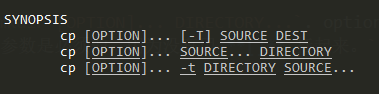

**RTFM** 是 **read the fucking manual** 的缩写，也就是 **阅读那该死的手册**。

man 手册一般都是自带的，如果没有可以手动安装下，`sudo yum install -y man-pages`。如果手册内容不全可以 `sudo ma ndb`.  

输入 man + 数字 + 命令/函数，就能查到相关的命令和函数，如果不加数字的话，默认从数字较小的手册中查找相关命令和函数。

手册中移动和上面的差不多，空格下一页，home好end实现开始和结尾的跳转，/ 键实现搜索，q键退出手册页。

## 手册页的不同区域
`man ls`进入手册后，可以发现分为几个区域。
* name 命令的名字
* synopsis 英语概要、大意、摘要的意思，包含了此命令的所有方法。
* description 包含此命令的所有用法。

## 举例详细说明 synopsis
`man mkdir`后， synopsis 区域显示 `mkdir [OPTION]... DIRECTORY...`. option 表示命令的参数，用 **[]** 包起来说明是可选的，directory 是目录，说明需要用 mkdir 命令创建的目录，这个参数是必须的，因为没有用 **[]** 括起来。`[OPTION]` 和 `DIRECTORY` 后面都有省略号代表可以有多个选项和多个目录名。  

synopsis 区域中，粗体的文字表示要原封不动的输入，例如 mkdir ，下划线的文字标识要用实际的内容替换。 
### 复杂点的例子
`man cp`, synopsis 区域有三行,因为一行已经没有办法来解释cp命令的使用方法。

* `cp [OPTION]... [-T] SOURCE DEST`: 可拷贝一个源文件为目标文件，可以加多个参数和一个 -T 参数。(算是重命名)
* `cp [OPTION]... SOURCE... DIRECTORY`: 可拷贝一个或者多个源文件到指定目录中。
* `cp [OPTION]... -t DIRECTORY SOURCE...`: 和上面效果是一样的，但是 -t 是必须要加的。

## apropos
前面查找手册命令的用法，但是首先你得知道命令什么吧，如果你连命令都不知道，就需要 apropos。他会根据关键字帮你把查找命令。

## whatis
man 手册的简化版本，大概描述一个命令的作用，例如`whatis ls`,就会输出 **list directory contents**。

