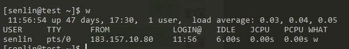

## w 命令
快速了解系统中目前有哪些用户登陆这，以及他们在干什么。

* **11:56:54** 就是当前的时间。
* **up** 是英语运行正常的意思，这里运行了47天，17点50开的机。也可以用 uptime 来查看这个信息。
* **1 user** 是当前只有一个用户登陆服务器。
* **load average** load是负载的意思，average是平均值的意思。后面的三个数值分别是1分钟之内的平均负载，5分钟之内的平均负载，15分钟之内的平均负载。
* 用户列表下的 **TTY** 表示用户登陆的终端
* **FROM** 用户连接到服务器的 IP 地址。
* **LOGIN** 登陆时间
* **IDLE** idle是不活跃的意思，这里表示用户多久没有运行任何命令了。
> w 命令其实 是 uptime 和 who 命令的集合。

## ps 和 top：列出运行的进程
直接输入ps查看运行的进程，pid是进程号，是process identity的缩写。但是只会列出2个进程，这是因为默认只会显示 ps 这个命令的相关进程。
* `ps -ef`: 列出所有进程，UID是进行进程的用户，PPID是程序的父进程号。
* `ps -u senlin`: 列出 senlin 此用户运行的进程。
* `ps -aux`: 通过 CPU 和内存使用来过滤进程，可以使用`ps -aux --sort -pcpu | less`来根据 CPU 使用率来降序排列。如果根据内存使用率排序就是`ps -aux --sort -pmem | less`

## top 动态进程
ps 命令是静态的，就是只会列出当前正在运行的进程信息的快照。而 top 是动态的。  
我们输入 top 进入动态页面后，可以根据快捷键来进行一些操作，
* 按下 U ，再输入 root 就只显示root用户的进程。
* 按下 k，再输入 pid，结束某个进程。

## glances
用 top 有点不美观，可以安装软件，然后用一个较为美观的界面去看动态进程。
```shell
yum install epel* -y
yum install python-pip python-devel -y
yum install glances -y
```
然后运行 glances 。

## htop
也是美观界面，因为前面安装了 `epel`, 这里直接 `yum install -y htop` 就好了。

## kill 命令
kill 后面跟上 PID 就能结束一个进程，也可以选择同事结束好几个进程，只要空格隔开 PID 就行了。  
有时候进程卡住了，kill 杀不到，就可以用 `kill -9 PID` 强制结束进程。  
`killall` 会结束全部进程，不同于kill，killall后面跟着的是程序名。而不是PID。

## halt 关闭系统，reboot 重启系统
都是需要用 root 权限才可以执行。事实上这两个命令其实都调用了 linux 中另一个命令，shutdown。

## poweroff 普通用户关机
