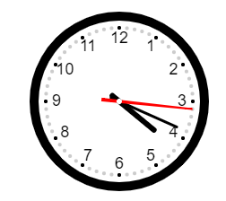

## 实现效果
[原本教程在此](https://www.imooc.com/learn/612).  
画一个有会动的,显示真实时间的时钟:



## canvas知识
[canvas的API手册](https://www.w3school.com.cn/tags/html_ref_canvas.asp)

通过js获取到页面的canvas标签元素，通过 `getContext("2d")` 获取到上下文，然后操作这个上线文就行了。

如果你想让canvas有动画效果，只要刷新重新绘制就好了。

## 思路逻辑

### 1. 因为我们要画的元素要和canvas的尺寸对应，比例要对，所以先把canvas元素尺寸提取出来。
```js
const dom = document.getElementById('clock')
const ctx = dom.getContext('2d')
const width = ctx.canvas.width
const height = ctx.canvas.height
const r = width/2
const rem = width / 200
```

### 2. 因为是要有完整的时间功能的动画，是用定时器每秒去获取真实时间后，刷新canvas渲染。

### 3. 用图层的概念去看时钟，他有背景层(也就是边框刻度)、小时指针、分钟指针、秒指针和扣子(时钟的中心点)，这些图层都是依次渲染叠加上去的。和2的代码放一起,如下:
```js
function draw() {
    ctx.clearRect(0, 0, width, height)
    var now = new Date()
    var hour = now.getHours();
    var minute = now.getMinutes()
    var second = now.getSeconds()
    drawBackground()
    drawHour(hour, minute)
    drawMinute(minute)
    drawSecond(second)
    drawDot()
}
draw()
    setInterval(draw, 1000)
```
canvas的刷新就是重新渲染，那既然要重新渲染就要先清除掉老的，`clearRect` 就是抹除画布。

### 4. 开始画背景，背景由三部分组成，外边圆，数字，刻度。

#### 先画圆:
```js
function drawBackground() {
    ctx.save()
    ctx.translate(r, r) //把远点位移到元素的中心
    ctx.beginPath() // 画线之前要先生成线条
    ctx.lineWidth = 10 * rem    // 给线条设置宽度
    // arc方法就是创造弧形用的，参数依次为x、y、半径、起始角、结束角。Math.PI = 3.14 = 180°
    ctx.arc(0, 0, r - ctx.lineWidth / 2, 0, 2*Math.PI, false)
    ctx.stroke()
}
```
**save** 和 **stroke** 算是配套的对应操作，当我们要想做旋转平移等操作的时候，就要对当前状态操作一下，否则下面再操作的话就错位了。

#### tudo--------------------

## 完整代码如下:
```html
<!DOCTYPE html>
<html lang="en">
  <head>
    <meta charset="utf-8" />
    <title>canvas画时钟</title>
    <style type="text/css">
      div {
        text-align: center;
        margin-top: 25px;
      }
    </style>
  </head>
  <body>
    <div>
      <canvas id="clock" height="200px" width="200px"></canvas>
    </div>
  </body>
  <script type="text/javascript">
    const dom = document.getElementById('clock')
    const ctx = dom.getContext('2d')
    const width = ctx.canvas.width
    const height = ctx.canvas.height
    const r = width/2
    const rem = width / 200
    function drawBackground() {
      ctx.save()
      ctx.translate(r, r)
      ctx.beginPath()
      ctx.lineWidth = 10 * rem
      ctx.arc(0, 0, r - ctx.lineWidth / 2, 0, 2*Math.PI, false)
      ctx.stroke()
      const hourNumbers = [3, 4, 5, 6, 7, 8, 9, 10, 11, 12, 1, 2]
      ctx.font = 18 * rem + 'px Arial'
      ctx.textAlign = 'center'
      ctx.textBaseline = 'middle'
      hourNumbers.forEach((number, index) => {
        const rad = 2 * Math.PI / 12 * index
        const x = Math.cos(rad) * (r - 30 * rem)
        const y = Math.sin(rad) * (r -30 * rem)
        ctx.fillText(number, x, y)
      })
      for(var i=0; i<60; i++) {
        const rad = 2 * Math.PI / 60 * i
        const x = Math.cos(rad) * (r - 18 * rem)
        const y = Math.sin(rad) * (r -18 * rem)
        ctx.beginPath()
        if (i % 5 === 0) {
          ctx.fillStyle = '#000'
          ctx.arc(x, y, 2 * rem, 0, 2 * Math.PI, false)
        } else {
          ctx.fillStyle = '#ccc'
          ctx.arc(x, y, 2 * rem, 0, 2 * Math.PI, false)
        }
        ctx.fill()
      }
    }
    function drawHour(hour, minute) {
      ctx.save()
      ctx.beginPath()
      const rad = 2 * Math.PI/12 * hour
      const mrad = 2 * Math.PI/12/60 * minute
      ctx.rotate(rad + mrad)
      ctx.lineWidth = 6 * rem
      ctx.lineCap = 'round'
      ctx.moveTo(0, 10 * rem)
      ctx.lineTo(0, -r / 2)
      ctx.stroke()
      ctx.restore()
    }
    function drawMinute(minute) {
      ctx.save()
      ctx.beginPath()
      const rad = 2 * Math.PI/60 * minute
      ctx.rotate(rad)
      ctx.lineWidth = 3 * rem
      ctx.lineCap = 'round'
      ctx.moveTo(0, 10 * rem)
      ctx.lineTo(0, -r + 30 * rem)
      ctx.stroke()
      ctx.restore()
    }
    function drawSecond(second) {
      ctx.save()
      ctx.beginPath()
      ctx.fillStyle = 'red'
      const rad = 2 * Math.PI/60 * second
      ctx.rotate(rad)
      ctx.moveTo(-2 * rem, 20 * rem)
      ctx.lineTo(2 * rem, 20 * rem)
      ctx.lineTo(1, -r + 18 * rem)
      ctx.lineTo(-1, -r + 18 * rem)
      ctx.fill()
      ctx.restore()
    }
    function drawDot() {
      ctx.beginPath()
      ctx.fillStyle = '#fff'
      ctx.arc(0, 0, 3 * rem, 0.2 * Math.PI, false)
      ctx.fill()
      ctx.restore()
    }
    function draw() {
      ctx.clearRect(0, 0, width, height)
      var now = new Date()
      var hour = now.getHours();
      var minute = now.getMinutes()
      var second = now.getSeconds()
      drawBackground()
      drawHour(hour, minute)
      drawMinute(minute)
      drawSecond(second)
      drawDot()
    }
    draw()
    setInterval(draw, 1000)
  </script>
</html>
```