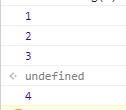

## 什么是微任务、宏任务
面试的时候总有一些面试官喜欢考些无聊的问题，例如这种的，问你执行的顺序:
```js
setTimeout(_ => console.log(4))

new Promise(resolve => {
  resolve()
  console.log(1)
}).then(_ => {
  console.log(3)
})

console.log(2)
```
虽然有 setTimeout 和 Promise 异步代码，但是却没有异步的逻辑操作，直觉上应该是顺序下来的也就是4132。

但是在f12中我们看下实际情况。



可以发现 Promise 和 setTimeout 虽然都是异步操作，但是待遇却不同，这是因为 Promise 是微任务，而 setTimeout 却是宏任务。

微任务的优先级高于宏任务。通常来讲宿主提供的异步都是宏任务，例如浏览器提供的 setTimeout 和 XHR对象 就是宏任务，js语言提供的都是微任务。