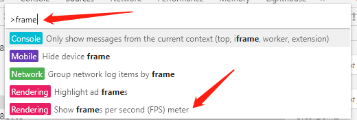

我们通过多种途径和工具，来衡量一个网站的性能好坏。

## network 加载概览

其中dom加载用了2.84秒，总的加载资源用了2.93秒。

## Lighthouse 给性能打分

## 观察帧数看动画是否流程
我们用 **ctrl shift p** 打开chrome的控制器，输入 **frame** 找到 **show frames per second(FPS) meter**.会检测页面的动画是否流程。

如果不明白具体值的好坏，可以根据这个 [来对比下比较差的帧率是什么样子的](http://googlesamples.github.io/web-fundamentals/tools/chrome-devtools/rendering-tools/forcedsync.html)。

## WebPageTest
WebPageTest 有[在线的](https://www.webpagetest.org),也有本地部署的，这里就只说下线上的。  
填入url后，可以可以现在地区，还可以选择浏览器对页面进行测试。

点击测试后等待一段时间,测试报告就出来了。

可以看到首次进入页面和第二次进入页面的速度。