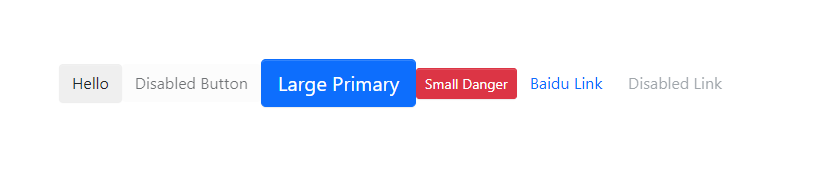
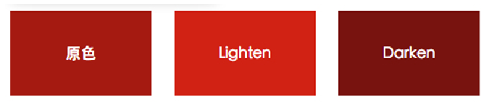

## 关于button的思考
我们要考虑到button组件的设计会遇到哪些问题呢？
1. button是有类型的，就是成功，失败，文字链接。成功和失败只是颜色的不同，但是link就完全不一样了。
2. button是有disabled的，按钮的disabled和link的disabled又是完全不同的。
3. 类型不同导致成功和失败的css样式怎么统一管理更科学？
4. ts怎么定义这些必传的，或是非必传的props。
5. button元素上是可以有很多原生属性的，例如 onClick 等等，组件内部怎么实现？TS怎么约束?

## 最简单有显示的button
```tsx
// src/components/Button/button.tsx
import React from 'react'

interface BaseButtonProps {
  children: React.ReactNode;
}
const Button = (props: BaseButtonProps) => {
  const { children } = props
  return (
    <button>{children}</button>
  )
}
export default Button
```
我们定义了 props 下的 children,这样就能使用最基本的功能了。
```js
// App.tsx
import React from 'react';
import Button from './components/Button/button'
function App() {
  return (
    <div>
      <Button>我是个按钮</Button>
    </div>
  );
}
export default App;
```

## 完善button组件

1. 要有 `btnType`, 值是个枚举，有**Primary、Default、Danger、Link**。
2. `link` 并不是个button，而是个a标签，是完全不同的，所以要有if判断才行。
3. 可以有 **disabled** 属性，其中 `link` 下的 **disabled** 和按钮的要区别对待,要单独写样式。
4. `link` 下有 href 属性，所以要添加到接口中去。
5. `size` 比较简单，就是个枚举，**Large、Small**
6. 每个type和size的样式是不一样的，所以要写不同的class，这些class都要在局部scss文件中定义好，然后通过 classnames 插件进行管理。
7. 需要注意的是，我们在使用组件的时候，是会添加自己的class的，这些也要放到标签里。
8. 有些属性是可以有默认值，虽然是必填的，但是用户不输入也不会报错。这就需要了 `defaultProps` 来给 props 添加默认值。

完成的内容如下:
```tsx
import React from 'react'
import classNames from 'classnames'

export enum ButtonSize {
  Large = 'lg',
  Small = 'sm'
}

export enum ButtonType {
  Primary = 'primary',
  Default = 'default',
  Danger = 'danger',
  Link = 'link'
}

interface BaseButtonProps {
  className?: string;
  disabled?: boolean;
  size?: ButtonSize;
  btnType?: ButtonType;
  children: React.ReactNode;
  href?: string;
}

const Button = (props: BaseButtonProps) => {
  const { children, btnType, className, size, disabled, href } = props
  const classes = classNames('btn', className, {
    [`btn-${btnType}`]: btnType,
    [`btn-${size}`]: size,
    'disabled': (btnType === ButtonType.Link) && disabled
  })
  if (btnType === ButtonType.Link && href ) {
    return (
      <a
        className={classes}
        href={href}
      >
        {children}
      </a>
    )
  } else {
    return (
      <button
        className={classes}
        disabled={disabled}
      >
        {children}
      </button>
    )
  }
}

Button.defaultProps = {
  disabled: false,
  btnType: ButtonType.Default
}

export default Button
```
我们在使用的时候:
```tsx
// App.tsx
import React from 'react';
import Button, { ButtonType, ButtonSize } from './components/Button/button'
function App() {
  return (
    <div>
      <Button className="custom"> Hello </Button>
      <Button disabled> Disabled Button </Button>
      <Button btnType={ButtonType.Primary} size={ButtonSize.Large}> Large Primary </Button>
      <Button btnType={ButtonType.Danger} size={ButtonSize.Small}> Small Danger </Button>
      <Button btnType={ButtonType.Link} href="http://www.baidu.com"> Baidu Link </Button>
      <Button btnType={ButtonType.Link} href="http://www.baidu.com" disabled> Disabled Link </Button>
    </div>
  );
}
export default App;
```
效果如下: 



## TS的痛点难点来了
现在我们的 Button 有个大问题，就是不能添加 onClick 这样的方法，或是 a 标签上的属性例如 `target="_blank"`。  

把问题和解法方案列一下：

1. 原生的方法和属性茫茫多，不可能一个一个的去写接口，React是提供了具体的接口，button的是 `React.ButtonHTMLAttributes<HTMLElement>`,a 标签的是 `React.AnchorHTMLAttributes<HTMLElement>`。  

然后要 `const {...restProps} = props`, 最把 `restProps` 复制给 button 元素

2. 自己定义的接口 `BaseButtonProps` 怎么和 react 提供的接口融合呢？可以使用TS中的交叉类型 **&**, 让一个类型包含两个类型的所有特性:
```tsx
type NativeButtonProps = BaseButtonProps & React.ButtonHTMLAttributes<HTMLElement>
type AnchorButtonProps = BaseButtonProps & React.AnchorHTMLAttributes<HTMLElement>
type ButtonProps = NativeButtonProps & AnchorButtonProps
```
通过 **type** 类型别名，我们最终得到了 **ButtonProps**,也就是包含了a和button标签上所有的属性和我们自定义的属性。

3. **ButtonProps** 也有个问题，例如对于 a 标签上有些属性是必须的，而我们是要用的是 button，必填的属性就报错了。可以使用TS提供全局的 **Partial** 类型，可以把所有的参数变成可选的。
```tsx
type ButtonProps = Partial<NativeButtonProps & AnchorButtonProps>
```
因为 Partial 已经帮我们把所有参数变成可选的了，自定义接口的 `?` 就可以去掉了。
4. `(props: ButtonProps)` 这样对 props 进行约束是可以的，但是不太优雅，最主要的是没有定义 props 里的 children 的类型,React 对组件是有类型的 `React.FC`,把 **接口** 当泛型传进去就OK了。这样也能拿到 children 了。
```tsx
const Button: React.FC<ButtonProps> = props => {
  // ...
}
```

## 关于 sass 的一些使用技巧
### mixin 的使用
sass中 mixin 的使用就是定义时 mixin，使用时 include。不过需要注意的是，引入时，mixin要在incalude前面。  

先看定义：
```scss
@mixin button-size($padding-y, $padding-x, $font-size, $border-raduis) {
  padding: $padding-y $padding-x;
  font-size: $font-size;
  border-radius: $border-raduis;
}
```
再看使用:
```scss
.btn {
  @include button-size( $btn-padding-y,  $btn-padding-x,  $btn-font-size,  $border-radius);
  &.disabled,
  &[disabled] {
    cursor: not-allowed;
    opacity: $btn-disabled-opacity;
    box-shadow: none;
    > * {
      pointer-events: none;
    }
  }
}
```
### sass 中的 lighten
除了 lighten 还有 darken，指的是颜色的高亮和暗色变化，lighten 有一定的提亮，用户直觉上有比较好的交互。
```scss
@mixin button-style(
  $hover-background: lighten($background, 7.5%),
  $hover-border: lighten($border, 10%),
) {
  color: $color;
  &:hover {
    color: $hover-color;
    background: $hover-background;
    border-color: $hover-border;    
  }
}
```


### 关于 css 的查缺补漏
1. `&[disabled]` 选择器的意思是，包含了 disabled 属性的元素。
2. `pointer-events: none;` 就是让鼠标事件失效。什么意思呢，举个例子:
```tsx
<Button disabled> <a href="http://www.baidu.com" target="_blank">Disabled Button</a> </Button>
```
如果没有这个属性，虽然按钮是禁用的，但是还是可以通过子元素 a 标签去打开页面，但是如果设置了就不会有事件发生。


## 扩展问题
### 1. 交叉类型和继承的不同？
上面我们用交叉类型实现了让一个类型拥有2个类型的属性，但其实还可以用继承来实现`interface BaseButtonProps extends React.ButtonHTMLAtrribute<HTMLElement>`。  

问题来了，交叉类型和继承有什么不同吗？可以看 [这个帖子](https://stackoverflow.com/questions/52681316/difference-between-extending-and-intersecting-interfaces-in-typescript),大概意思是说当两种类型的成员具有相同的属性键时，如何处理它们的差异。

### 2. React.ButtonHTMLAtrribute为什么要添加 HTMLElement 泛型？
`HTMLElement`的泛型是必填的，作用是，当你 `<Button onClick={(e) => {e.currentTarget}}>` 时， `currentTarget` 就拥有了EventTarget 和 HTMLElment 的类型。  
那么我们怎么知道传入的是 HTMLElement 的类型当泛型呢？  

基本依赖 **经验**。。包括你怎么知道 `React.ButtonHTMLAtrribute`类型呢？也是没用查询的地方，只能看源码，凭经验。

### 3. 为啥叫 btnType 而不是 type？
这是因为 button 和 link 都有默认的type属性，可以用 TS 内置的 Omit 方法：
```tsx
type NativeButtonProps = BaseButtonProps & Omit<ButtonHTMLAttributes<HTMLElement>, 'type'>
type AnchorButtonProps = BaseButtonProps & Omit<AnchorHTMLAttributes<HTMLElement>, 'type'>
```
