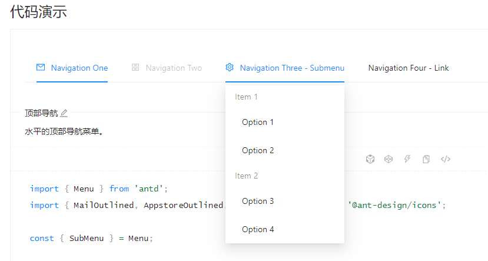
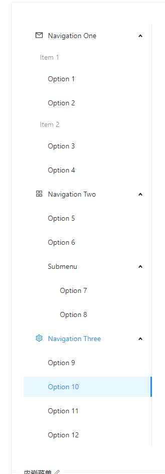

## menu 导航菜单

首先看看 [antd官方的menu](https://ant.design/components/menu-cn/)。





## 分析下功能和展现:

1. menu 可以是横向展示的，也可以是竖向排列的。
2. 有 disabled 的menu项置灰，不可点击，不可展开自项，没有hover效果。
3. 有展开页，横向中hover卡片类型展现，竖向是点击子级展开。
4. 有子项的失去点击事件(横向)，或是点击事件是展开回缩子项(竖向)。

## 分析下属性和事件

### 属性
1. 和 andt 一样，组件分为三个部分，**Menu** **Menu.Item** **SubMenu** 。
2. Menu 上有 **mode**，横竖向。
3. Menu 上有 **defaultIndex**，默认选中项。
4. Menu.Item **defaultOpenSubMenus**,默认需要展开的项(只有竖向有用)。
5. Menu.Item 上有 **disabled** 禁用
6. SubMenu 上有 **title**，其实就是没有子项的 Menu.Item 的名字。

### 事件
1. Menu 上有 **onSelect**,参数是 index，点击 Menu.Item 就会触发对应的事件。

使用案例如下:
```tsx
// ...
import Menu from './components/Menu/menu'
import MenuItem from './components/Menu/menuItem'  
import SubMenu from './components/Menu/subMenu'
// ...
<Menu defaultIndex='0' onSelect={(index) => {alert(index)}} mode="vertical" defaultOpenSubMenus={['2']}>
  <MenuItem>
    cool link
  </MenuItem>
  <MenuItem disabled>
    cool link 2
  </MenuItem> 
  <SubMenu title="dropdown">
    <MenuItem>
      dropdown 1
    </MenuItem>
    <MenuItem>
      dropdown 2
    </MenuItem>
  </SubMenu>        
  <MenuItem>
    cool link 3
  </MenuItem>
</Menu>
// ...
```

## 遇到的问题

1. 写在组件上的 style 类型如何定义？答案是react提供的 `React.CSSProperties`.
2. `props.children` 有个槽点，他的类型是不定的，如果没有子节点他就是  **undefined**，有一个子节点是 **object**，多个子节点是 **array**，处理起来有点麻烦。不过 react 提供了一个方法 `React.Children.map` 兼容这几种不同的数据类型。用法和普通的 map 函数略有不同:
```tsx
React.Children.map(children, (child, index) => {
  return <li>{index + 1}</li>
})
```
3. 上面例子代码中的 child 其实就是个组件 `<MenuItem/>`，但是在使用上他却是个属性。这就出现了一个问题，如果我想添加个属性 index 怎么加呢？似乎是没办法，幸好 react 提供了一个方法 `React.cloneElement`，可以创建一个类标签，把属性加上去。
```tsx
import { MenuItemProps } from './menuItem'
const renderChildren = () => {
  return React.Children.map(children, (child, index) => {
    const childElement = child as React.FunctionComponentElement<MenuItemProps>
    const { displayName } = childElement.type
    if (displayName === 'MenuItem' || displayName === 'SubMenu') {
      return React.cloneElement(childElement, {
        index: index.toString()
      })
    } else {
      console.error("Warning: Menu has a child which is not a MenuItem component")
    }
  })
}
```
4. `childElement` 没有类型定义，TS会报错，所以还要类型断言为 `React.FunctionComponentElement`。
5. menu 组件里面只能放 `MenuItem` 和 `SubMenu`，放别的就给出报错。实现这个功能的话，可以在子组件上挂载个自定义属性(算是props)，然后可以用 `childElement.type` 拿到子组件的 props，再进行判断。
```tsx
// ...
MenuItem.displayName = 'MenuItem'
export default MenuItem
```

#### 这里，简单的架子完成了，下面开始写 subMenu,思路是差不多的，然后全部的代码如下:
```tsx
// ... menux.tsx
import React from 'react'
import classNames from 'classnames'
import { MenuItemProps } from './menuItem'

type MenuMode = 'horizontal' | 'vertical'
type SelectCallback = (selectedIndex: string) => void;

export interface MenuProps {
  defaultIndex?: string;
  className?: string;
  mode?: MenuMode;
  style?: React.CSSProperties;
  onSelect?: SelectCallback;
  defaultOpenSubMenus?: string[];
}

const Menu: React.FC<MenuProps> = props => {
  const { className, mode, style, children } = props
  const classes = classNames('viking-menu', className, {
    'menu-vertical': mode === 'vertical',
    'menu-horizontal': mode !== 'vertical',
  })
  const renderChildren = () => {
    return React.Children.map(children, (child, index) => {
      const childElement = child as React.FunctionComponentElement<MenuItemProps>
      const { displayName } = childElement.type
      if (displayName === 'MenuItem' || displayName === 'SubMenu') {
        return React.cloneElement(childElement, {
          index: index.toString()
        })
      } else {
        console.error("Warning: Menu has a child which is not a MenuItem component")
      }
    })
  }
  return (
    <ul className={classes} style={style}>
      {renderChildren()}
    </ul>
  )
}
Menu.defaultProps = {
  defaultIndex: '0',
  mode: 'horizontal',
  defaultOpenSubMenus: [],
}
export default Menu
```
***
```tsx
// menuItem.tsx
import React from 'react'
import classNames from 'classnames'

export interface MenuItemProps {
  index?: string;
  disabled?: boolean;
  className?: string;
  style?: React.CSSProperties;
}

const MenuItem: React.FC<MenuItemProps> = (props) => {
  const { children, className, disabled, style } = props
  const classes = classNames('menu-item', className, {
    'is-disabled': disabled
  })
  return (
    <li className={classes} style={style}>
      {children}
    </li>
  )
}

MenuItem.displayName = 'MenuItem'

export default MenuItem
```
***
```tsx
// subMenu
import React, { FunctionComponentElement } from 'react'
import classNames from 'classnames'
import { MenuItemProps } from './menuItem'

export interface SubMenuProps {
  className?: string;
  title: string;
}

const SubMenu: React.FC<SubMenuProps> = ({className, title, children}) => {
  const classes = classNames('menu-item submenu-item', className)
  const renderChildren = () => {
    const subMenuClasses = classNames('viking-submenu')
    const childrenComponent = React.Children.map(children, (child, i) => {
      const childElement = child as FunctionComponentElement<MenuItemProps>
      if (childElement.type.displayName === 'MenuItem') {
        return React.cloneElement(childElement)
      } else {
        console.error("Warning: SubMenu has a child which is not a MenuItem component")
      }
    })
    return (
      <ul className={subMenuClasses}>
        {childrenComponent}
      </ul>
    )
  }
  return (
    <li className={classes}>
      <div>{title}</div>
      {renderChildren()}
    </li>
  )
}

SubMenu.displayName = 'SubMenu'

export default SubMenu
```

*** 至此大概组件的模子是出来，但是里面的很多细节都没有实现