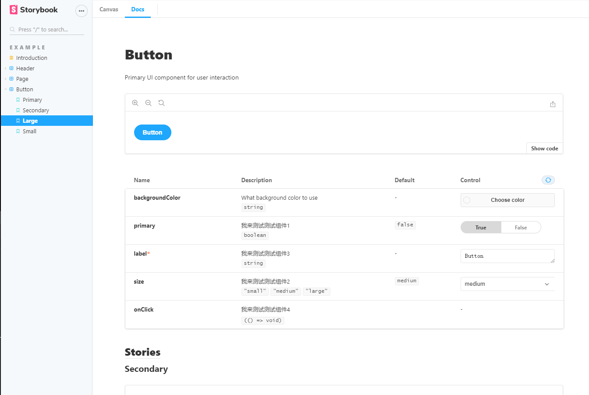

[官网先奉上](https://storybook.js.org/)


## 安装
```sh
npx -p @storybook/cli sb init
```
安装后就根据提示 `npm run storybook` 就能运行一个新端口项目，里面有一些 demo 实例。  

> storybook 不仅支持react也支持vue，他们会根据脚手架的环境变量信息去自动生成对应的demo。  
不仅如此，还会根据你是js还是ts来生成对应的demo。

## 观察和使用

我们先看看官网的demo  


再看看 demo 代码,用注释讲解配置:
```tsx
import React from 'react';
// also exported from '@storybook/react' if you can deal with breaking changes in 6.1
import { Story, Meta } from '@storybook/react/types-6-0';

import { Button, ButtonProps } from './Button';

export default {
  title: 'Example/Button', // Example是左侧 aside 第外层分组，Button是第二次内容
  component: Button,
  argTypes: { // 不知道啥意思，得看官网介绍，大概是可以给组件附带一些选项，可以不写的。
    backgroundColor: { control: 'color' }, // 这个就是给组件的背景色附带了个颜色选择器
  },
} as Meta;

const Template: Story<ButtonProps> = (args) => <Button {...args} />; // 需要把我们组件的 props 传进去

export const Primary = Template.bind({}); // 我们在文档中的组件，也是aside的第三层，在正文中第一个是作为默认展示组件的
Primary.args = { // 就是给组件的参数
  primary: true,
  label: 'Button',
};

export const Secondary = Template.bind({}); // 在文档中是作为 case 存在的
Secondary.args = {
  label: 'Button',
};
```

## 参数说明
我们可以看到图片中的参数表单中有组件全部的参数，以及描述和默认值。这些都是在组件中去定义配置的。看代码:
```tsx
import React from 'react';
import './button.css';

export interface ButtonProps {
  /**
   * 我来测试测试组件1
   */
  primary?: boolean;
  /**
   * What background color to use
   */
  backgroundColor?: string;
  /**
   * 我来测试测试组件2
   */
  size?: 'small' | 'medium' | 'large';
  /**
   * 我来测试测试组件3
   */
  label: string;
  /**
   * 我来测试测试组件4
   */
  onClick?: () => void;
}

/**
 * Primary UI component for user interaction
 */
export const Button: React.FC<ButtonProps> = ({
  primary = false,
  size = 'medium',
  backgroundColor,
  label,
  ...props
}) => {
  const mode = primary ? 'storybook-button--primary' : 'storybook-button--secondary';
  return (
    <button
      type="button"
      className={['storybook-button', `storybook-button--${size}`, mode].join(' ')}
      style={{ backgroundColor }}
      {...props}
    >
      {label}
    </button>
  );
};

```

* 可以看到我们可以通过注释来添加参数的描述
* 组件接受prop时的默认值也是属性的默认值
* interface 属性为必填项时table中也会是必填。
* 当属性为字符自变量时，`'small' | 'medium' | 'large'`，此属性为select，可以操作。
* 当属性为 boolean 时，会有个开关供你操作。
 
## addon
addon 就是 storybook 的插件，像 **showCode** 这种功能都是addon的功劳。

## 后语
上面的demo只是 storybook 非常基础的功能，事实上，怎么显示文件都有不同的方法，也可以自己配置 config 文件更加定制化或者全局化。

可惜 storybook 没有比较好的中文支持，看官网文档吃力啊。