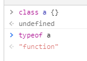

## app.js
一个非常常见的 class 组件。
```js
class Hello {
  render() {
    return React.createElement('div', null, `版本3，类组件的实现`);
  }
}
const helloWorld = React.createElement(Hello, null, null);
ReactDOM.render(helloWorld, document.getElementById('root'));
```

## react.js
我们分辨是不是函数组件用的是 `typeof parentEle === 'function'`,但是 class 本身也是 function。


解决的方法挺简单粗暴的，就是把 class类 转成 string，然后用正则判断是不是 class 开头。  
如果是 class组件 的话，就 new 一下，然后返回组件的 `render()` 值(也就是组件).

```js
function createElement(parentEle, props, ...childEles) {
  if (typeof parentEle === 'function' && /^\s*class\s+/.test(parentEle.toString())) {
    let component = new parentEle();
    return component.render();
  }else if (typeof parentEle === 'function'){
    return parentEle();
  }else {
    // ...
  }
}
```