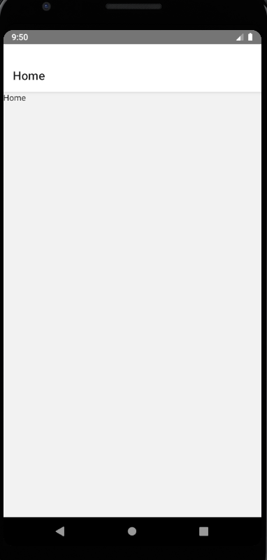

## 安装堆栈式导航器

react-native是有自己的导航器的，但是不太好用，现在官方都推荐使用 [react-navigation](https://reactnavigation.org/) 了。

```shell
npm install @react-navigation/native
```
还要安装相关的库:
* react-native-reanimated 用组件化的方式实现动画，性能较好。
* react-native-gesture-handler 手势库
* react-native-screens 实现安卓和IOS原生代码的调用
* react-native-safe-area-context 因为异形屏的原因，我们需要知道哪些区域是安全的。
* @react-native-community/masked-view 堆栈式导航器所需要的库

```shell
npm install react-native-reanimated react-native-gesture-handler react-native-screens react-native-safe-area-context @react-native-community/masked-view
```
如果是mac开发IOS的话，需要安装pod:
```shell
npx pod-install ios
```
然后在根 **index.js** 文件引入: `import 'react-native-gesture-handler';`

最后我们要将整个程序包装在 **NavigationContainer** 标签中：
```js
// App.tsx
// ...
import { NavigationContainer } from '@react-navigation/native';
export default function App() {
  return (
    <NavigationContainer>{/* Rest of your app code */}</NavigationContainer>
  );
}
```
> 这只是个例子，事实上，我们 navigator导航器 应该由一个单独的文件去管理，**App.txs** 去引用。

## 写一个堆栈式导航 demo
> 堆栈式导航和前端路由差不多一个意思，是有回退键的，还能传参。
堆栈式导航器要先安装：
```shell
npm i @react-navigation/stack
```
新建个文件，专门装导航器，`src/naviator/index.tsx`:
```tsx
import React from 'react';
import {NavigationContainer} from '@react-navigation/native';
import {createStackNavigator} from '@react-navigation/stack';
import Home from '@/pages/Home'; // 没写，就当它有吧
import Detail from '@/pages/Detail'; // 没写，就当它有吧
const Stack = createStackNavigator();
class Navigator extends React.Component {
  render() {
    return (
      <NavigationContainer>
        <Stack.Navigator>
          <Stack.Screen name="Home" component={Home} />
          <Stack.Screen name="Detail" component={Detail} />
        </Stack.Navigator>
      </NavigationContainer>
    );
  }
}
export default Navigator;
```
`App.tsx` 引用下：
```tsx
import React from 'react';
import Navigator from '@/navigator/index';

declare const global: {HermesInternal: null | {}};

const App = () => {
  return (
    <>
      <Navigator />
    </>
  );
};

export default App;
```
看下效果：  



## android 和 IOS 的兼容问题
`android` 和 `IOS` 的风格是不同的，例如上图中的 HOME title就是居左的，但是在IOS中是在中的。  
当然，这样是没问题的，但是如果一定要风格统一的话，就要单独处理一下：
```tsx
<Stack.Navigator
  screenOptions={{
    headerTitleAlign: 'center',
  }}>

  ...
<Stack.Navigator/>
```
还可以单独处理其中的某一项令其居中(优先级高)：
```tsx
<Stack.Screen options={{headerTitleAlign: 'center'}} name="Home" component={Home} />
```
还可以给每个页面设置名称：
```tsx
<Stack.Screen options={{headerTitle: '首页'}} name="Home" component={Home} />
```

## 导航器跳转
官网的例子是用hooks写的，简单一些，就在 Home 组件外层传递下 props：
```js
// src/naviator/index.tsx
<Stack.Screen name="Home">
  {props => <HomeScreen {...props}/>}
</Stack.Screen>
```
Home 取出`navigation` 后操作跳转：
```js
function HomeScreen({ navigation }) {
  return (
    <Button
      title="Go to Details"
      onPress={() => navigation.navigate('Details')}
    />
  );
}
```
但是这里就不能这么用，原因是一方面是因为暂时是class开发，另一方面是TS问题。 
***
```tsx
// src/naviator/index.tsx
import {StackNavigationProp} from '@react-navigation/stack';
type RootStackParamList = {
  Home: undefined;
  Detail: undefined;
};
export type RootStackNavigation = StackNavigationProp<RootStackParamList>;
```
```tsx
// Home.tsx
import {RootStackNavigation} from '@/navigator/index';
interface IProps {
  navigation: RootStackNavigation;
}
class Home extends React.Component<IProps> {
  onPress = () => {
    const {navigation} = this.props;
    navigation.navigate('Detail');
  };
  render() {
    return (
      <Button title="跳转到详情页" onPress={this.onPress} />
    );
  }
}
export default Home;
```
这样写的TS优势是，`navigate()`的值，只能是Home或者Detail,并且会有代码提示。

## 导航器动效统一
目前我们页面跳转和返回的动画，IOS上是左右滑动，而安卓是上下滑动的.
`Stack.Navigator` 有个属性 `headerMode`，他有三个值，`none` 就是没有头部，`float` 就是浮动头部，我们设置`float`，IOS没变化，安卓title不再有动画。
再导入IOS动画`HeaderStyleInterpolators`，让安卓头部的路由切换有左右滑动的效果.  
再引入`CardStyleInterpolators`，让安卓的内容的切换也是有左右滑动的效果.  
IOS返回时可以通过左滑返回，设置`gestureEnabled`让安卓也开启.
安卓的返回手势是从上到下，设置`gestureDirection`，让其变成水平左右的.
安卓在回滑的时候边缘处有阴影而IOS很淡，设置`headerStyle`来单独处理平台样式.
```tsx
import {HeaderStyleInterpolators, CardStyleInterpolators} from '@react-navigation/stack';
import {Platform, StyleSheet} from 'react-native';
<Stack.Navigator
  headerMode="float"
  screenOptions={{ 
    headerTitleAlign: 'center',
    headerStyleInterpolator: HeaderStyleInterpolators.forUIKit,
    cardStyleInterpolator: CardStyleInterpolators.forHorizontalIOS,
    gestureEnabled: true,
    gestureDirection: 'horizontal',
    headerStyle: {
      ...Platform.select({
        android: {
          elevation: 0,
          borderBottomWidth: StyleSheet.hairlineWidth,
        },
      }),
    },
  }}/>
```
> **单词学习中**  
**Interpolators**：窜改者，插入器  
**Kit**：工具箱，装备  
**hairline**：发际线，极细的线

## 导航传参
和前端路由传参一个意思，带个ID啊啥的。js就比较简单了，`navigate()` 第二个参数是个对象，就是传给新路由的参数，新页面常规的拿值就行。  
但是TS稍稍有点复杂，首先我们要让这个 `id` 为必传项,其次，Detail页面中要知道外部的必传值是 `id`,关键点就在于泛型，上代码：
```tsx
// navigator/index.tsx
export type RootStackParamList = {
  Home: undefined;
  Detail: {
    id: number;
  };
};
```
```tsx
// Home.txs
navigation.navigate('Detail', {
  id: 100,  // 这里如果不传就会报错
});
```
```tsx
import {RouteProp} from '@react-navigation/native';
import {RootStackParamList} from '@/navigator/index';
interface IProps {
  // 把导入的type作为泛型，第二个参数指定当前导航名称
  route: RouteProp<RootStackParamList, 'Detail'>; 
}
class Detail extends React.Component<IProps> {
  render() {
    const {route} = this.props;
    return (
      <View>
        <Text>{route.params.id}</Text>
      </View>
    );
  }
}
```