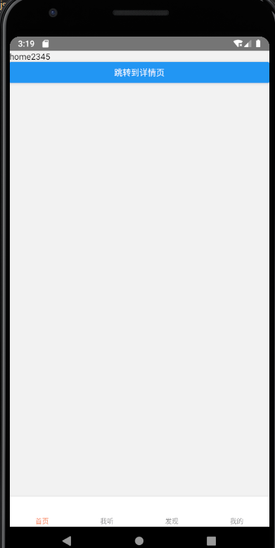

## 安装标签导航器
[先官网走起](https://reactnavigation.org/docs/tab-based-navigation)
```shell
npm install @react-navigation/bottom-tabs
```

## 使用标签导航器
标签导航器和堆栈式导航器一样的，都是 `NavigationContainer` 包裹一个由 `create...Navigator` 产生的标签。  
* Navigator 中用 `activeTintColor` 改变 tab 的选中颜色。
* Screen 中用 `tabBarLabel` 改变 tab 的页面名称。

在 navigator 下新建 `BottomTabs.tsx`:
```tsx
// navigator/BottomTabs.tsx
import React from 'react';
import {NavigationContainer} from '@react-navigation/native';
import {createBottomTabNavigator} from '@react-navigation/bottom-tabs';
import Home from '@/pages/Home';
import Listen from '@/pages/Listen'; // 假装有
import Found from '@/pages/Found'; // 假装有
import Account from '@/pages/Account'; // 假装有
export type BottomTabParamList = {
  Home: undefined;
  Listen: undefined;
  Found: undefined;
  Account: undefined;
};

const Tab = createBottomTabNavigator();

class BottomTabs extends React.Component {
  render() {
    return (
      <NavigationContainer>
        <Tab.Navigator
          tabBarOptions={{
            activeTintColor: '#f87442',
          }}>
          <Tab.Screen
            name="Home"
            component={Home}
            options={{tabBarLabel: '首页'}}
          />
          <Tab.Screen
            name="Listen"
            component={Listen}
            options={{tabBarLabel: '我听'}}
          />
          <Tab.Screen
            name="Found"
            component={Found}
            options={{tabBarLabel: '发现'}}
          />
          <Tab.Screen
            name="Account"
            component={Account}
            options={{tabBarLabel: '我的'}}
          />
        </Tab.Navigator>
      </NavigationContainer>
    );
  }
}
export default BottomTabs;
```
`App.tsx` 中改变下引入就可以了。
```tsx
import Navigator from '@/navigator/BottomTabs';
```


## 导航器之间的嵌套
其实很简单，要明白的是，全局只有一个 `<NavigationContainer>` 标签。  
我们把 Home 组件的引入改一下:
```tsx
import Home from './index';
```
然后把上个章节的 `navigator/index.tsx` 的 `<NavigationContainer>` 删掉，就OK了。


## 嵌套的更多些的细节
我们改一下嵌套的方式，就是堆栈导航里面嵌套tabs。操作很简单，和上面的是相反的操作:
1. App.tsx 中引入 `'@/navigator/index'`
2. navigator/index.tsx 中导入 `'./BottomTabs'` 并成为首页的组件。
3. 删除 BottomTabs.tsx 的 `<NavigationContainer>` 标签。

现在又有个问题，因为我们是堆栈式导航内嵌套标签导航，以至于我们不管切换那个 **tabs** ,title都是首页。  
解决方法就是在 `BottomTabs.tsx` 组件中的生命周期函数里，根据 props 中的导航器提供的方法去动态生成自己的头部内容。
```tsx
// navigator/BottomTabs.tsx
// ...
import {RootStackNavigation, RootStackParamList} from './index';
import {RouteProp, TabNavigationState} from '@react-navigation/native';
type Route = RouteProp<RootStackParamList, 'BottomTabs'> & {
  state?: TabNavigationState;
};

interface IProps {
  navigation: RootStackNavigation;
  route: Route;
}
function getHeaderTitle(route: Route) {
  const routeName = route.state
    ? route.state.routes[route.state.index].name
    : route.params?.screen || 'Home';
    // 这个 route.params?.screen 其实不写也无所谓（其实我也不太明白）
  switch (routeName) {
    case 'Home':
      return '首页';
    case 'Listen':
      return '我听';
    case 'Fond':
      return '发现';
    case 'Account':
      return '账户';
    default:
      return '首页';
  }
}
class BottomTabs extends React.Component<IProps> {
  componentDidUpdate() {
    const {navigation, route} = this.props;
    navigation.setOptions({
      headerTitle: getHeaderTitle(route),
    });
  }
  // ...
}
```
> 逻辑不复杂，但是这TS着实看不懂啊。。。