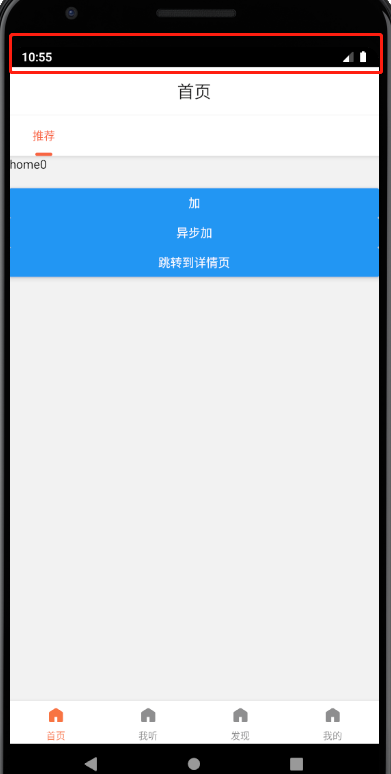
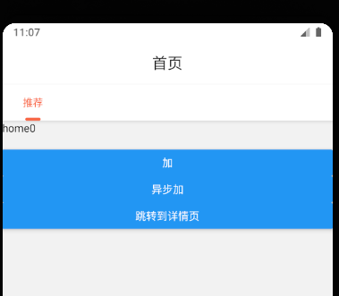

## 顶部标签导航器的安装
```shell
npm i @react-navigation/material-top-tabs react-native-tab-view
```
> react-native-tab-view 是标签导航器所依赖的第三方库。

## 使用
和上面的两个导航器的用法是差不多的，导入 createMaterialTopTabNavigator 函数，生成`<Tab.Navigator>`和`<Tab.Screen>`标签。
`tabBarOptions` 有很多参数:
* 我们的tab标签是默认屏幕内等分的，如果想让其有宽度，并可以左右滑动，可以:
```tsx
<Tab.Navigator 
  tabBarOptions={{
    scrollEnabled: true,
    tabStyle: {
      width: 80,
    }
  }}
  />

```
* 还可以通过 `indicatorStyle` 改变tab选中时的下杠的样式：
```tsx
<Tab.Navigator 
  tabBarOptions={{
    indicatorStyle: {
      height: 4,
      width: 20,
      marginLeft: 30,
      borderRadius: 2,
      backgroundColor: '#f86442',
    },
  }}
  />
```
* `activeTintColor` 改变选中时的tab文字颜色
* `inactiveTintColor` 改变未选中时的tab文字颜色
* 假如我们有2个tab，如果你想让另一个tab没有切换的时候是懒加载的，在 `Tab.Navigator` 标签加上 `lazy` 即可。
***
我们在 navigator 下新建个 `BottomTabs.tsx` ：
```tsx
// navigator/BottomTabs.tsx
import React from 'react';
import {createMaterialTopTabNavigator} from '@react-navigation/material-top-tabs';
import Home from '@/pages/Home';

const Tab = createMaterialTopTabNavigator();

class HomeTabs extends React.Component {
  render() {
    return (
      <Tab.Navigator
        lazy
        tabBarOptions={{
          scrollEnabled: true,
          tabStyle: {
            width: 80,
          },
          indicatorStyle: {
            height: 4,
            width: 20,
            marginLeft: 30,
            borderRadius: 2,
            backgroundColor: '#f86442',
          },
          activeTintColor: '#f86442',
          inactiveTintColor: '#333',
        }}>
        <Tab.Screen
          name="Home"
          component={Home}
          options={{tabBarLabel: '推荐'}}
        />
      </Tab.Navigator>
    );
  }
}

export default HomeTabs;
```
然后把 **BottomTabs.tsx** 中的`import Home from '@/pages/Home';` 改为 `import HomeTabs from './HomeTabs';` 即可(Home相关的也都要改啊)。效果如下：



## 改变最顶部样式
上图我们红色框中是机器默认的黑色的，我们可以 `src/index.tsx` 下与 `Navigator` 标签平级下，添加 `StatusBar` 标签来改变样式：
```tsx
// src/index.tsx
import {StatusBar} from 'react-native';
export default class extends React.Component {
  render() {
    return (
      <Provider store={store}>
        <Navigator />
        <StatusBar
          backgroundColor="transparent"
          barStyle="dark-content"
          translucent
        />
      </Provider>
    );
  }
}
```

***
> **单词小课堂**  
**material**：材料，素材，身体需要的
**indicator**：指标，标志 
**inactive**：不活跃的，这个简单，in + active  
**tint**： 色彩，浅色，给...着色  
**transparent**： 透明的，显然的
**translucent**： 透明的；半透明的
