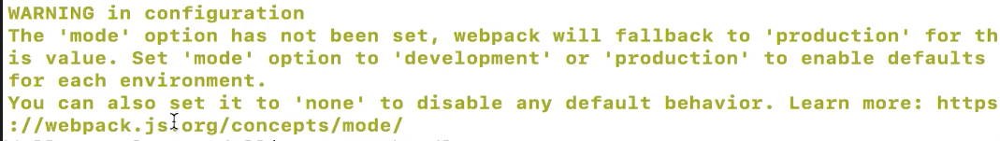

# 浅析webpack打包输出的内容

1. `Hash:1bb547ce......`  本地打包对应的唯一编号
2. `Version:webpack 4.25.1`  当前的webpack版本
3. `Time:162ms`  本地打包的时间
4. `Asset:bundle.js`  本地打包后的文件
5. `Size:1.36kib`  文件大小
6. `chunks:0`  我们在打包时,有可能会打包很多文件,chunks里面的内容就是这些文件对应的id.
7. `chunkName:main.js`  作用和chunks是一样的,装的是文件的名字,不过这个main.js是怎么来的?我们打包的不是index.js吗?
    这个其实是因为我们在webpack.config.js中`entry:'./index.js'`是缩写.全写是这样的
    ```JavaScript
        entry:{
            main:'./index,js'
        }
    ```
    我们不过是给main.js起了个别名而已,其实我们打包的入口文件一直都是main.js.
    
#### 黄色警告的报错是什么意思呢

  
  
  这个是因为没有在webpack.config.js中设置mode参数,如果我们不写mode参数,打包是可以成功的,而且是压缩后的代码.但是会有警告,如果添加   `mode:'production'`
  打包效果是一样的,而且没有了警告.
  如果我们不想打包后的文件是没有被压缩过的,直接设置`mode:'development'`即可.