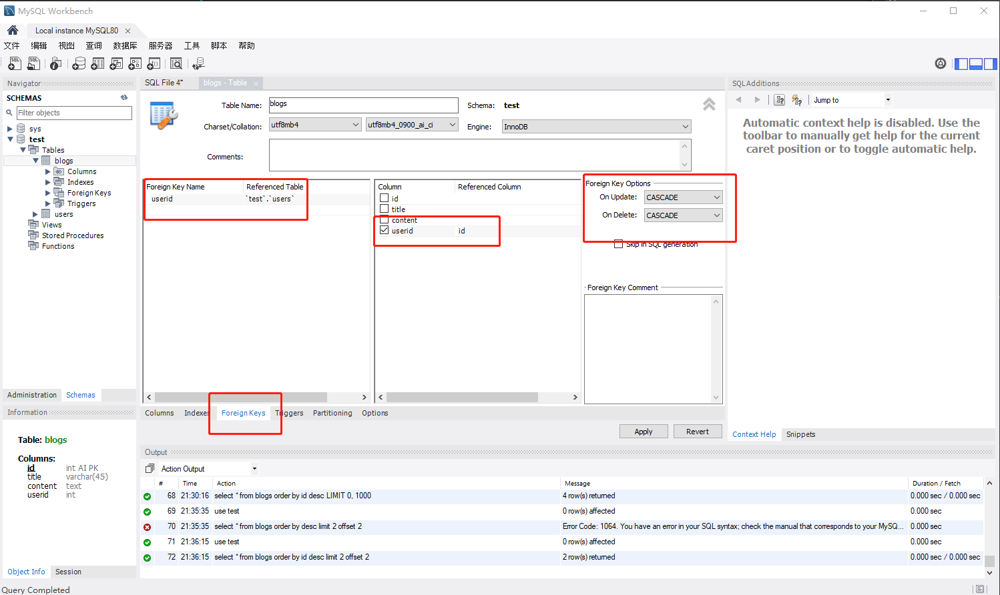

## 安装 mysql
 
### 先安装windows下的环境
[知乎上一篇比较详细的安装教程](https://zhuanlan.zhihu.com/p/37152572)

不过我遇到的一个坑，是安装MySQL需要依赖 `microsoft visual c++ 2019 redistributable package (x64)`,如果没有的话无法下一步。  
下载下来安装好重启就ok了，为了照顾没有翻墙能力的同学，我把这两个软件放到自己的服务器里面，提供大家下载。

[MySQL-windows的安装包](http://49.233.185.168:3003/software/mysql-installer-community-8.0.21.0.msi)

[visual c++ 2019 windows-x64的安装包](http://49.233.185.168:3003/software/VC_redist.x64.exe)

下载安装mysql,mysql workbench(可视化操作 )

## 安装 workbench
[workbench](http://49.233.185.168:3003/software/mysql-workbench-community-8.0.21-winx64.msi) 是操作数据库可视化工具,还可以进行一些简单鸡肋的汉化。  
先下载[汉化文件](http://49.233.185.168:3003/software/main_menu.xml),然后打开 workbench 的安装目录，例如我的是`C:\Program Files\MySQL\MySQL Workbench 8.0 CE\data`,把文件放进去覆盖原来的就行了。

我们打开 workbench 软件，点击左上角 加号和桶 的图标，`create a schema in connected server`,输入 `test` 名字后点击 apply，用默认即可，再次点击 apply.创建的`test`用于后面的demo暂时。

## 建表
test的数据库是有了，但是点击展开下面的 Tables 还是空的。我们右键 `create tables` 建个 `users`和 `blogs` 的表。

**users**
column数据名称|datatype数据类型|pk主键|nn不为空|AI自动增加|default
--|:--:|--:|--:|--:|--:
id|int|Y|Y|Y|
username|varchar(20)||Y||
password|varchar(20)||Y||
nickname|varchar(20)||Y||

**blogs**
column数据名称|datatype数据类型|pk主键|nn不为空|AI自动增加|default
--|:--:|--:|--:|--:|--:
id|int|Y|Y|Y|
title|varchar(50)||Y||
content|text||Y||
userid|int||Y||

> 如果没有实际操作的话可能不太明白这个表单什么意思，实际上建表的过程就是在填这个表单

## 简单的增删改查
可以点击左上角 +SQL 的图标，新建个SQL文件用于数据库的增删改查。
```sql
use test;

select * from users;

select * from blogs;
```
点击上方的 闪电 图标执行操作，没有返回什么，因为我们还没数据。

### 插入一条数据
```sql
use test;
insert into users(username,`password`,nickname) values('李四','123','李四')
```
> id因为是设置的AI所以不用传，其中`password`是mysql的关键字，所以要括起来转译。

再次查询，发现返回了数据
```sql
select username,nickname from users;
-- 也可以使用 where 来模拟下登陆的效果
select user,nickname from users where username='张三'and`password`='123';
-- 也能找到对应的数据
```

### 插入blogs表数据后更新一条数据
```sql
--insert into blogs (title,content,userid) values ('标题1', '内容1', 1);
--insert into blogs (title,content,userid) values ('标题2', '内容2', 1);
--insert into blogs (title,content,userid) values ('标题3', '内容3', 2);
--insert into blogs (title,content,userid) values ('标题4', '内容4', 2);
update blogs set content='内容1内容1' where id='1';
```

### 删除数据
```sql
delete from blogs where id=4;
```
### 倒序查询
```sql
select * from blogs order by id desc;
-- desc是降序的意思
```
### 查询数据总行数:
```sql
select count(id) as `count` from blogs;
```
### 查倒序第二页,每页2行:
```sql
select * from blogs order by id desc limit 2 offset 2;
-- limit 2 让每次查询只有2行， offset 2 是跳过2页。
```

## 外键
建立外键什么意思呢,blogs表中有一个userid,用于记录这个博客是哪个用户的,我们可以通过外键来关联这两个表的数据.  
有如下好处：
* 更新限制  
如果你新建一个博客而这个博客的userid不存在则会直接报错。
* 删除级联  
当你删除一个用户的时候，userid为此用户的所有博客也很被删除。
* 连表查询

### 建立外键
把blogs表中的的userid和users表中的id关联，右击blogs表单，选择`alter tables`。


 